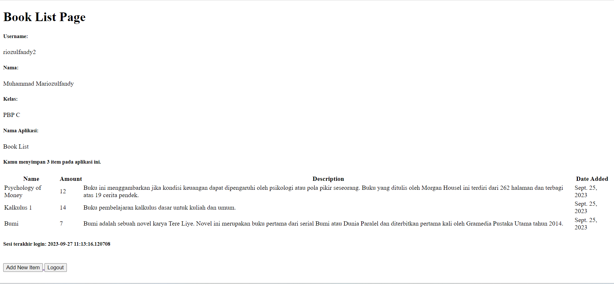

# Tugas PBP
Halo, namaku Rio dan ini adalah repository untuk tugas mata kuliah Pemrograman Berbasis Platform (PBP). Berikut adalah detail pengembangan pada setiap tugas.

<details>
    <summary>
        Tugas 5
    </summary>

Nama      : Muhammad Mariozulfandy

NPM       : 2206041404

Kelas     : PBP C

Aplikasi  : Book List

### 1. Jelaskan manfaat dari setiap element selector dan kapan waktu yang tepat untuk menggunakannya!

= Elemen Selector dalam CSS adalah metode pemilihan elemen berdasarkan nama elemen dalam dokumen HTML, seperti ```<p>```, ```<h1>```, atau ```<div>```. Manfaat utama dari penggunaan element selector adalah kemampuannya untuk menerapkan gaya secara konsisten pada semua elemen dengan nama yang sama di seluruh halaman web. Hal ini berguna ketika kita ingin mengaplikasikan gaya dasar ke seluruh elemen dengan nama yang sama tanpa perlu menambahkan kelas atau ID tambahan. Element selector sebaiknya digunakan ketika konsistensi tampilan elemen-elemen tersebut adalah prioritas utama dalam desain halaman web.

### 2. Jelaskan HTML5 Tag yang kamu ketahui!

= HTML5 adalah versi terbaru dari bahasa markup HTML yang menawarkan tag-tag baru untuk menggambarkan struktur dan makna dari konten dalam dokumen HTML. Beberapa tag HTML5 yang umum digunakan antara lain:

- ```<header>```: Digunakan untuk bagian kepala dokumen atau bagian dari sebuah situs web.
- ```<nav>```: Untuk menyusun menu navigasi.
- ```<section>```: Mengelompokkan konten yang terkait dalam sebuah bagian.
- ```<article>```: Menandai konten yang dapat berdiri sendiri, seperti posting blog atau berita.
- ```<footer>```: Bagian bawah dari dokumen atau elemen tertentu.
- ```<video>```: Digunakan untuk menampilkan video. Tag-tag ini membantu meningkatkan struktur dan semantik dalam dokumen HTML.

### 3. Jelaskan perbedaan antara margin dan padding!

= Margin dan padding adalah dua properti CSS yang digunakan untuk mengatur ruang di sekitar elemen. Margin mengatur ruang di luar elemen dan mempengaruhi jarak antara elemen dengan elemen lainnya. Di sisi lain, padding mengatur ruang di dalam elemen dan mempengaruhi jarak antara konten elemen dan batas elemen tersebut. Ini berarti bahwa margin mempengaruhi ruang antara elemen dan elemen lain di sekitarnya, sedangkan padding mempengaruhi ruang antara konten elemen dan batas elemen itu sendiri.

### 4. Jelaskan perbedaan antara framework CSS Tailwind dan Bootstrap! Kapan sebaiknya kita menggunakan Bootstrap daripada Tailwind, dan sebaliknya?

= Bootstrap dan Tailwind CSS adalah dua alat yang berbeda untuk membangun tampilan situs web. Bootstrap menyediakan berbagai komponen yang sudah didesain dan siap pakai, sehingga memungkinkan kita membuat situs dengan cepat tanpa harus membuat banyak kode CSS kustom. Di sisi lain, Tailwind CSS memberikan banyak utilitas CSS yang lebih dasar yang memungkinkan kita membuat tampilan yang lebih unik sesuai kebutuhan. Ketika kita perlu membuat situs dengan cepat menggunakan komponen siap pakai, Bootstrap bisa menjadi pilihan yang baik. Sementara itu, jika kita ingin lebih banyak kontrol dan kreativitas dalam desain tampilan, Tailwind bisa lebih cocok. Pilihannya tergantung pada kebutuhan proyek masing-masing.

### 5. Jelaskan bagaimana cara kamu mengimplementasikan checklist di atas secara step-by-step (bukan hanya sekadar mengikuti tutorial)!

= **a. Kustomisasi halaman login, register, dan tambah inventori semenarik mungkin.**

- Didalam ```base.html```, tambahkan tag ```<meta name="viewport">``` agar halaman web dapat menyesuaikan ukuran dan perilaku perangkat mobile.
```html
<head>
    
        <meta charset="UTF-8" />
        <meta name="viewport" content="width=device-width, initial-scale=1">
    
</head>
```

- Menambahkan Bootstrap CSS, JS, dan jQuery.
```html
<head>
    ...
    
    <link rel="stylesheet" href="https://stackpath.bootstrapcdn.com/bootstrap/4.5.2/css/bootstrap.min.css">
    <script src="https://code.jquery.com/jquery-3.5.1.slim.min.js"></script>
    <script src="https://cdn.jsdelivr.net/npm/@popperjs/core@2.11.6/dist/umd/popper.min.js"></script>
    <script src="https://stackpath.bootstrapcdn.com/bootstrap/4.5.2/js/bootstrap.min.js"></script>
</head>
```

- Kustomisasi halaman login ```login.html```, register ```register.html```, dan penambahan item ```create_item.html``` dengan penggunaan warna dan card.

login:
```html



    <title>Login</title>



<div class="container mt-5">
    <div class="row justify-content-center">
        <div class="col-md-6">
            <div class="card">
                <div class="card-header bg-primary text-white">Login</div>
                <div class="card-body">
                    <form method="POST" action="">
                        
                        <div class="form-group">
                            <label for="username">Username:</label>
                            <input type="text" name="username" id="username" placeholder="Username" class="form-control">
                        </div>
                        <div class="form-group">
                            <label for="password">Password:</label>
                            <input type="password" name="password" id="password" placeholder="Password" class="form-control">
                        </div>
                        <div class="form-group">
                            <button class="btn btn-primary btn-block" type="submit">Login</button>
                        </div>
                    </form>
                    
                        <div class="alert alert-danger">
                            <ul>
                                
                                    <li>{{ message }}</li>
                                
                            </ul>
                        </div>
                    
                    <p class="text-center">Don't have an account yet? <a href="">Register Now</a></p>
                </div>
            </div>
        </div>
    </div>
</div>

```
register:
```html



    <title>Register</title>



<div class="container mt-5">
    <div class="row justify-content-center">
        <div class="col-md-8"> <!-- Increase the column size to 8 -->
            <div class="card">
                <div class="card-header bg-primary text-white">
                    Register
                </div>
                <div class="card-body">
                    <form method="POST">
                        
                        
                        <div class="form-group">
                            {{ form.as_p }}
                        </div>
                        
                        <div class="form-group text-center">
                            <button class="btn btn-primary btn-block" type="submit" name="submit">
                                Daftar
                            </button>
                        </div>
                    </form>
                    
                    
                    <div class="alert alert-danger">
                        <ul>
                            
                            <li>{{ message }}</li>
                            
                        </ul>
                    </div>
                    
                </div>
            </div>
        </div>
    </div>
</div>

```

create_item:
```html
 


<div class="container mt-5">
    <div class="row justify-content-center">
        <div class="col-md-6">
            <div class="card">
                <div class="card-header bg-primary text-white">Add New Item</div>
                <div class="card-body">
                    <form method="POST">
                        
                        <div class="form-group">
                            {{ form.as_p }}
                        </div>
                        <div class="form-group">
                            <button class="btn btn-primary btn-block" type="submit">Add Item</button>
                        </div>
                    </form>
                </div>
            </div>
        </div>
    </div>
</div>

```
**b. Kustomisasi halaman daftar inventori menjadi lebih berwarna maupun menggunakan approach lain seperti menggunakan Card.**

- Melakukan kustomisasi halaman daftar item ```main.html``` menjadi lebih berwarna dan menggunakan approach Card agar mirip dengan halaman login, register, dan create_item. Selain halamannya, daftar item yang awalnya tabel juga diubah menjadi bentuk card.

```html



    <div class="container mt-5">
        <div class="row">
            <div class="col-lg-20">
                <div class="card w-100">
                    <div class="card-header bg-primary text-white">
                        <h2 class="mb-0">Book List</h2>
                    </div>
                    <div class="card-body">
                        <div class="user-info">
                            <h5>Username:</h5>
                            <p>{{ Username }}</p>

                            <h5>Nama:</h5>
                            <p>{{ Nama }}</p>

                            <h5>Kelas:</h5>
                            <p>{{ Kelas }}</p>

                            <h5>Nama Aplikasi:</h5>
                            <p>{{ Aplikasi }}</p>
                        </div>

                        <hr>

                        <div class="item-count">
                            <h5 class="text-info">Kamu menyimpan {{ jumlah_items }} item pada aplikasi ini.</h5>
                        </div>

                        <hr>

                        <div class="container mt-5">
                            <div class="row">
                                
                                <div class="col-lg-4 mb-3">
                                    <div class="card">
                                        <div class="card-header latest-item-header">
                                            <h5 class="card-title">{{ item.name }}</h5>
                                        </div>
                                        <div class="card-body">
                                            <p class="card-text">Amount: {{ item.amount }}</p>
                                            <p class="card-text">Description: {{ item.description }}</p>
                                            <p class="card-text">Date Added: {{ item.date_added }}</p>
                                        </div>
                                    </div>
                                </div>
                                
                            </div>
                        </div>

                        <hr>

                        <h5 class="text-success">Sesi terakhir login: {{ last_login }}</h5>

                        <hr>

                        <div class="button-container">
                            <a href="" class="btn btn-success">
                                <i class="fas fa-plus"></i> Add New Item
                            </a>

                            <a href="" class="btn btn-danger">
                                <i class="fas fa-sign-out-alt"></i> Logout
                            </a>
                        </div>
                    </div>
                </div>
            </div>
        </div>
    </div>

```

**Bonus. Memberikan warna yang berbeda (teks atau background) pada baris terakhir dari item pada inventori anda menggunakan CSS.**

- Membuat directory ```static/css``` dan membuat file ```styles.css``` pada root directory.
```
book_list/
├── book_list/
├── main/
├── static/
│   └── css/
│       └── styles.css  <-- File CSS
└── ...
```

- Membuat css class pada ```styles.css``` untuk menentukan style card item.
```css
.card {
    border: 1px solid #ccc;
    border-radius: 5px;
}

.card-header {
    background-color: #f0f0f0;
    font-weight: bold;
    text-align: center;
}

.card-title {
    margin-bottom: 0;
}

.latest-item-header {
    background-color: #3399ff;
    font-weight: bold;
}
```

- Menambahkan link ke ```styles.css``` yang telah dibuat pada template ```base.html```.
```html
<head>
    ...
    <link rel="stylesheet" type="text/css" href="">
</head>
```

- Menambahkan konfigurasi pengaturan projek pada ```settings.py```.
```python
# Static files (CSS, JavaScript, Images)
# https://docs.djangoproject.com/en/4.2/howto/static-files/
STATIC_URL = 'static/'
STATICFILES_DIRS = [BASE_DIR / 'static']
```

- Menjalankan ```python manage.py collectstatic``` untuk mengumpulkan semua static files pada satu direktori. Yang siap dideploy ke production server.

- Menambahkan ```<div class="card-header latest-item-header">``` ke class ```card-header``` pada laman ```main.html``` agar last item yang dilooping mengikuti class ```latest-item-header``` pada ```styles.css```.

</details>

<details>
    <summary>
        Tugas 4
    </summary>

Nama      : Muhammad Mariozulfandy

NPM       : 2206041404

Kelas     : PBP C

Aplikasi  : Book List

### 1. Apa itu Django UserCreationForm, dan jelaskan apa kelebihan dan kekurangannya?

= UserCreationForm adalah formulir bawaan Django yang memudahkan pembuatan formulir pendaftaran pengguna dalam aplikasi web. Dengan formulir ini, pengguna baru dapat mendaftar dengan mudah di situs web Anda tanpa harus menulis kode dari awal. Kelebihan dari UserCreationForm adalah mudah digunakan (cepat menempatkan fitur pendaftaran pengguna aplikasi web tanpa perlu menulis kode form secara manual), validasi otomatis (memastikan pengguna memasukkan informasi yang valid saat mendaftar termasuk pemeriksaan ketersediaan alamat email dan validasi password), terintegrasi dengan fitur autentikasi Django seperti login dan logout, dan dapat dikustomisasi dengan membuat form sendiri yang menurunkan kelas UserCreationForm. Kekurangannya adalah hanya meminta informasi dasar seperti username, password, dan alamat email. Sehingga kurang fleksibel jika membutuhkan informasi tambahan atau langkah-langkah lain dalam pendaftaran. Selain itu, UserCreationForm juga memiliki beberapa pengaturan bawaan yang bisa jadi tidak sesuai dengan kebutuhan aplikasi sehingga perlu diubah agar mendapatkan kontrol yang lebih tinggi.

### 2.  Apa perbedaan antara autentikasi dan otorisasi dalam konteks Django, dan mengapa keduanya penting?

= Authentication (autentikasi) memverifikasi identitas pengguna atau layanan sebelum memberi mereka akses seperti permintaan username dan password, sementara Authorization (otorisasi) menentukan apa yang dapat mereka lakukan setelah mereka memiliki akses seperti perbedaan akses yang dimiliki oleh user dan admin pada suatu website. Contohnya pada aplikasi X (dulunya Twitter) dimana awalnya akan dilakukan autentikasi (permintaan username dan password) agar memperoleh akses akun yang dapat menggunakan berbagai fitur di X. Setelah masuk di X, akan dilakukan otorisasi untuk mengenali apa yang dapat kita lakukan, jika kita adalah user biasa fitur-fitur yang kita bisa gunakan akan berbeda dengan verified user (yang dapat diperoleh dengan membayar ke X). Keduanya penting karena autentikasi and otorisasi adalah dua proses utama keamanan informasi yang digunakan administrasi untuk melindungi sistem dan informasi, dimana autentikasi memverifikasi identitas pengguna sehingga identitas yang mengakses sistem dapat diketahui dan otorisasi menentukan apakah akses yang mereka punya benar sehingga tidak ada kesalahan dalam penggunaan sistem.

### 3. Apa itu cookies dalam konteks aplikasi web, dan bagaimana Django menggunakan cookies untuk mengelola data sesi pengguna?

= Cookies adalah jenis data yang disimpan di sisi klien (biasanya di browser web) saat pengguna berinteraksi dengan situs web. Cookies digunakan untuk menyimpan potongan kecil informasi  yang dapat diakses oleh server web ketika pengguna kembali ke situs web. Mereka digunakan untuk berbagai tujuan, termasuk mengidentifikasi pengguna, menyimpan preferensi, dan melacak perilaku pengguna.

Django menggunakan cookies untuk mengelola data sesi pengguna melalui modul yang disebut sessions (sesi). Django menggunakan cookie untuk mengelola data sesi pengguna dengan cara menghasilkan ID sesi unik untuk setiap pengguna yang disimpan dalam cookie di sisi klien saat pengguna mengakses situs web. Data sesi sebenarnya disimpan di server Django, bukan di cookie itu sendiri. Saat pengguna kembali ke situs web, Django mengidentifikasi pengguna berdasarkan ID sesi yang disimpan dalam cookie, dan kemudian mengambil data sesi yang sesuai dari server. Ini memungkinkan Django untuk menjaga status login pengguna, menyimpan preferensi, dan memberikan pengalaman yang personal kepada pengguna, semuanya dengan aman dan terlindungi dari potensi ancaman keamanan.

### 4. Apakah penggunaan cookies aman secara default dalam pengembangan web, atau apakah ada risiko potensial yang harus diwaspadai?

= Penggunaan cookies dalam pengembangan web bisa menjadi aman atau berisiko tergantung pada bagaimana mereka digunakan. Cookies adalah file kecil yang disimpan di perangkat pengguna saat mengakses situs web, dan mereka digunakan untuk menyimpan informasi seperti login, preferensi, atau keranjang belanja. Namun, ada risiko keamanan jika cookies disalahgunakan oleh penyerang. Misalnya, penyerang bisa mencuri data pribadi atau meretas akun pengguna jika cookies tidak diatur dengan baik. Oleh karena itu, untuk menjaga keamanan, pastikan menggunakan HTTPS, atur waktu kedaluwarsa yang tepat, enkripsi data sensitif, dan selalu ikuti peraturan privasi data yang berlaku.

### 5. Jelaskan bagaimana cara kamu mengimplementasikan checklist di atas secara step-by-step (bukan hanya sekadar mengikuti tutorial)!

= **a. Mengimplementasikan fungsi registrasi, login, dan logout.**

- Membuat masing-masing fungsi untuk menampilkan halaman registrasi ```register```, login ```login_user```, dan logout ```logout_user``` pada ```views.py```.

```python
def register(request):
    form = UserCreationForm()

    if request.method == "POST":
        form = UserCreationForm(request.POST)
        if form.is_valid():
            form.save()
            messages.success(request, 'Your account has been successfully created!')
            return redirect('main:login')
    context = {'form':form}
    return render(request, 'register.html', context)
```
```python
def login_user(request):
    if request.method == 'POST':
        username = request.POST.get('username')
        password = request.POST.get('password')
        user = authenticate(request, username=username, password=password)
        if user is not None:
            login(request, user)
            return redirect('main:show_main')
        else:
            messages.info(request, 'Sorry, incorrect username or password. Please try again.')
    context = {}
    return render(request, 'login.html', context)
```
```python
def logout_user(request):
    logout(request)
    return redirect('main:login')
```

- Membuat/menambahkan berkas html yang akan ditampilkan saat melakukan registrasi, login, logout. Untuk registrasi dan login akan membuat halaman baru yang akan ditampilkan yaitu ```register.html``` dan ```login.html```, sementara logout berupa tombol pada halaman ```main.html``` yang mengarahkan ke urlpatterns yang mengimplementasi fungsi untuk logout.

- Menambahkan urlspatterns pada ```urls.py``` yang mengimplementasikan setiap fungsi pada ```views.py``` yang dibuat agar dapat dijalankan sesuai request yang diterima.

```python
urlpatterns = [
    ...
    path('register/', register, name='register'), 
    path('login/', login_user, name='login'),
    path('logout/', logout_user, name='logout')
]
```
- Merestriksi akses halaman main agar diperlukan login terlebih dahulu. Dilakukan dengan menambahkan ```@login_required(login_url='/login')``` di atas fungsi ```show_main```. Ini sebagai bentuk autentikasi agar halaman main hanya dapat diakses pengguna yang sudah registrasi dan login.

**b. Membuat dua akun pengguna dengan masing-masing tiga dummy data menggunakan model yang telah dibuat pada aplikasi sebelumnya untuk setiap akun di lokal.**

Implementasi:

Saat membuka halaman utama web, akan diperlukan login (autentikasi) sehingga mengarah ke halaman login. Di halaman login dapat menekan tombol ```Register Now``` untuk mengarah ke halaman register. Membuat akun dengan username (riozulfandy), passsword, dan konfirmasi password. Dilakukan hal yang sama untuk akun kedua dengan username (riozulfandy2). Pada masing-masing akun, ditambahakan tiga objek model data (Item) dengan fitur fungsi pembuatan objek pada form yang  yang sudah dibuat sebelumnya. Saat ini, setiap objek Item memiliki empat atribut (nama, jumlah, deskripsi, tanggal ditambahkan). Karena konteks website ini (Book List) adalah list buku, maka atribut objek yang diisi dengan nama, deskripsi, dan jumlah buku. Screenshot halaman main masing-masing akun:




**c. Menghubungkan model Item dengan User.**

- Menambahkan atribut model Item yaitu ```user``` yang berisi objek dari model User (model yang menyimpan informasi semua user yang pada aplikasi). Dalam hal ini digunakan many to one model relationship yang dapat menghubungkan banyak objek Item dengan satu objek User.

```python
class Item(models.Model):
    user = models.ForeignKey(User, on_delete=models.CASCADE)
    ...
```

- Mengubah fungsi ```create_item``` agar  Django tidak langsung menyimpan objek yang telah dibuat dari form langsung ke database untuk dimodifikasi terlebih dahulu. Pada kasus ini, kita akan mengisi atribut user pada objek Item dengan objek User dari nilai ```request.user``` yang sedang terotorisasi untuk menandakan bahwa objek tersebut dimiliki oleh pengguna yang sedang login.

```python
def create_item(request):
 form = ProductForm(request.POST or None)

 if form.is_valid() and request.method == "POST":
     item = form.save(commit=False)
     item.user = request.user
     item.save()
     return HttpResponseRedirect(reverse('main:show_main'))
 ...
```

- Mengubah fungsi ```show_main``` sehingga items yang akan ditampilkan pada halaman main adalah milik user dengan melakukan filtering objek Item sehingga atribut user nya sama dengan user yang sedang login.

```python
def show_main(request):
    items = Item.objects.filter(user=request.user)
    ...
```

- Melakukan ```makemigrations``` dan ```migrate``` karena telah mengubah model. Sehingga database dapat menyesuaikan sesuai struktur model yang baru.

**d. Menampilkan detail informasi pengguna yang sedang logged in seperti username dan menerapkan cookies seperti last login pada halaman utama aplikasi.**

- Mengubah fungsi ```login_user```, dengan membuat cookie yang bernama ```last_login``` untuk melihat kapan terakhir kali pengguna melakukan login yang diset saat pengguna melakukan login.

```python
if user is not None:
    login(request, user)
    response = HttpResponseRedirect(reverse("main:show_main")) 
    response.set_cookie('last_login', str(datetime.datetime.now()))
    return response
```

- Mengubah fungsi ```logout_user``` agar cookie ```last_login``` yang sebelumnya dibuat set saat login dihapus saat logout.

```python
def logout_user(request):
    logout(request)
    response = HttpResponseRedirect(reverse('main:login'))
    response.delete_cookie('last_login')
    return response
```

- Menambahkan konteks pada fungsi ```show_main``` untuk menampilkan username dari user yang sedang login dan cookie ```last_login``` yang sudah dibuat saat user login. Karena menambahkan konteks, juga perlu ditambahkan key dari konteks tersebut pada ```main.html``` untuk ditampilkan.

```python
context = {
        ...
        'Username': request.user.username,
        'last_login': request.COOKIES['last_login'],
        ...
    }
```
```html
...
<h5>Username:</h5>
<p>{{Username}}</p>
...
```
```html
...
<h5>Sesi terakhir login: {{ last_login }}</h5>
...
```

</details>

<details>
    <summary>
        Tugas 3
    </summary>

Nama      : Muhammad Mariozulfandy

NPM       : 2206041404

Kelas     : PBP C

Aplikasi  : Book List

### 1. Apa perbedaan antara form POST dan form GET dalam Django?

= GET digunakan untuk membaca/mengambil data dari server web. GET mengembalikan kode status HTTP 200 (OK) jika data berhasil diambil dari server. Sementara POST digunakan untuk mengirim data (file, data form, dll) ke server. Jika pembuatan berhasil, ia mengembalikan kode status HTTP 201. Berikut beberapa perbedaannya:

POST:

- Nilai variabel tidak ditampilkan di URL

- Lebih aman

- Tidak dibatasi panjang string

- Pengambilan variabel dengan request.POST.get

- Biasanya untuk input data melalui form

- Digunakan untuk mengirim data-data penting seperti password

GET:

- Nilai variabel ditampilkan di URL sehingga user dapat dengan mudah memasukkan nilai variabel baru

- Kurang aman

- Dibatasi panjang string sampai 2047 karakter

- Pengambilan variabel dengan request.POST.get

- Biasanya untuk input data melalui link

- Digunakan untuk mengirim data-data tidak penting

### 2. Apa perbedaan utama antara XML, JSON, dan HTML dalam konteks pengiriman data?

= XML adalah bahasa markup yang sangat fleksibel dan dapat digunakan untuk mendefinisikan struktur data yang kompleks. Ini menggunakan tag yang dapat disesuaikan oleh pengguna untuk mendefinisikan elemen data dan hierarki. JSON adalah format data ringkas yang berbasis teks dan memiliki struktur yang mirip dengan objek JavaScript. Ini terdiri dari pasangan nama-nilai (key-value pairs). HTML adalah bahasa markup yang digunakan untuk membuat halaman web. Ini memiliki struktur yang lebih terbatas dan dirancang untuk menampilkan konten dalam bentuk halaman web. Perbedaan utama diantaranya adalah XML digunakan untuk mendefinisikan struktur data yang kompleks, JSON digunakan untuk pertukaran data dalam format ringkas, sedangkan HTML digunakan untuk membuat halaman web dan menampilkan konten. 

### 3. Mengapa JSON sering digunakan dalam pertukaran data antara aplikasi web modern?

= JSON adalah format data yang ringkas dan mudah dibaca oleh programmer dalam bentuk (key-value pairs). JSON bagian integral dari JavaScript, sehingga memudahkan penggunaannya dalam lingkungan pengembangan web yang berbasis JavaScript. JSON juga mendukung struktur data yang bersarang (nested), yang memungkinkan representasi data yang kompleks dan hierarkis. Selain itu, format data JSON yang ringan dalam hal ukuran. Ini menghasilkan overhead yang lebih rendah dalam pertukaran data antara klien dan server, yang dapat meningkatkan kinerja dan kecepatan dalam aplikasi web.

### 4. Jelaskan bagaimana cara kamu mengimplementasikan checklist di atas secara step-by-step (bukan hanya sekadar mengikuti tutorial)!

= 

**a. Membuat input form untuk menambahkan objek model (item) pada app sebelumnya.**

- Membuat file baru dengan nama forms.py pada aplikasi main untuk membuat struktur form yang dapat menerima data baru.

```python
from django.forms import ModelForm
from main.models import Item

class ItemForm(ModelForm):
    class Meta:
        model = Item
        fields = ["name", "amount", "description"]
```

Item merupakan model yang digunakan untuk form (yang telah dibuat pada Tugas 1). Ketika data dari form disimpan, isi dari form akan disimpan menjadi sebuah objek class Item. Fields berisi field dari model Item yang digunakan untuk form.

- Membuat template HTML baru bernama create_item.html untuk menampilkan form untuk membuat item baru.

```html
 


<h1>Add New Item</h1>

<form method="POST">
    
    <table>
        {{ form.as_table }}
        <tr>
            <td></td>
            <td>
                <input type="submit" value="Add Item"/>
            </td>
        </tr>
    </table>
</form>


```


- Import beberapa package dan membuat fungsi baru dengan nama create_item yang menerima parameter request untuk membuat form yang membuat objek item baru.

```python
from django.http import HttpResponseRedirect
from main.forms import ItemForm
from django.urls import reverse
```
```python
def create_item(request):
    form = ItemForm(request.POST or None)

    if form.is_valid() and request.method == "POST":
        form.save()
        return HttpResponseRedirect(reverse('main:show_main'))
    context = {'form': form}
    return render(request, "create_item.html", context)
```
Melakukan render tampilan template create_item.html kemudian membuat objek ItemForm berdasarkan QueryDict yang diinput user, dilakukan validasi, disimpan, dan redirect ke page main.

- Menambahkan button pada main.html yang mengarah url dari fungsi create_item pada view yang telah dibuat untuk membuat form.
```html
    <a href="">
        <button>
            Add New Item
        </button>
    </a>
```

- Membuat routing url pada urls.py yang mengarah ke fungsi create_item untuk pembuatan form. Dengan menambahkan ```path('create-item', create_item, name='create_item')``` pada list urlpatterns.

**b. Menambahkan 5 fungsi views untuk melihat objek yang sudah ditambahkan dalam format HTML, XML, JSON, XML by ID, dan JSON by ID.**

- Melihat objek yang sudah ditambahkan dalam format HTML dilakukan dengan memperbarui fungsi show_main dengan menambahkan setiap objek Item yang sudah ditambahkan sebelumnya untuk dirender serta jumlah dari objek Item yang sudah ditambahkan sebelumnya. Karena show_main melakukan render terhadap main.html, main.html juga diperbarui dengan menambahkan tabel yang berisi setiap atribut dari setiap objek Item yang telah dibuat sebelumnya (name, amount, description, date_added) dan jumlah dari objek yang ditambahkan sebelumnya.

```python
def show_main(request):
    items = Item.objects.all()
    jumlah_items = Item.objects.all().count()

    context = {
        'Nama': 'Muhammad Mariozulfandy',
        'Kelas': 'PBP C',
        'Aplikasi': 'Book List',
        'items': items,
        'jumlah_items': jumlah_items
    }

    return render(request, "main.html", context)
```
```html
<h5>Kamu menyimpan {{jumlah_items}} item pada aplikasi ini.</h5>

<table>
    <tr>
        <th>Name</th>
        <th>Amount</th>
        <th>Description</th>
        <th>Date Added</th>
    </tr>

     Berikut cara memperlihatkan data produk di bawah baris ini 

    
        <tr>
            <td>{{item.name}}</td>
            <td>{{item.amount}}</td>
            <td>{{item.description}}</td>
            <td>{{item.date_added}}</td>
        </tr>
    
</table>
```

- Melihat objek yang sudah ditambahkan dalam format XML, JSON, JSON by ID, dan XML by ID dilakukan dengan memanfaatkan ```django.core.serializers``` untuk transformasi data menjadi format lain seperti XML dan JSON. Untuk XML dan JSON, data yang ditransformasi adalah semua objek pada Item yang telah ditambahkan sebelumnya. Sementara JSON by ID dan XML by ID, data yang ditransformasi adalah data dengan ID yang ditetapkan (dilakukan filtering). Implementasi dilakukan dengan menambahkan fungsi show_xml dan show_json yang menerima parameter request dan show_xml_by_id dan show_json_by_id yang menerima parameter request dan ID.
```python
def show_xml(request):
    data = Item.objects.all()
    return HttpResponse(serializers.serialize("xml", data), content_type="application/xml")
def show_json(request):
    data = Item.objects.all()
    return HttpResponse(serializers.serialize("json", data), content_type="application/json")
def show_xml_by_id(request, id):
    data = Item.objects.filter(pk=id)
    return HttpResponse(serializers.serialize("xml", data), content_type="application/xml")
def show_json_by_id(request, id):
    data = Item.objects.filter(pk=id)
    return HttpResponse(serializers.serialize("json", data), content_type="application/json")
```

**c. Membuat routing URL untuk masing-masing views yang telah ditambahkan pada poin b.**

Ini dilakukan dengan menambahkan path pada list urlpatterns di urls.py untuk masing-masing fungsi views yang telah dibuat.
```python
path('xml/', show_xml, name='show_xml'),
path('json/', show_json, name='show_json'),
path('xml/<int:id>/', show_xml_by_id, name='show_xml_by_id'), #Menambahkan variabel id karena dipakai sebagai parameter
path('json/<int:id>/', show_json_by_id, name='show_json_by_id'), #Menambahkan variabel id karena dipakai sebagai parameter
```

### 5. Mengakses kelima URL di nomor 4c menggunakan Postman, membuat screenshot dari hasil akses URL pada Postman, dan menambahkannya ke dalam README.md.

=


</details>

<details>
    <summary>
       Tugas 2
    </summary>


Nama      : Muhammad Mariozulfandy

NPM       : 2206041404

Kelas     : PBP C

Aplikasi  : Book List

### 1. Jelaskan bagaimana cara kamu mengimplementasikan checklist di atas secara step-by-step (bukan hanya sekadar mengikuti tutorial)!

= 
- Pertama, membuat direktori baru pada lokal untuk menyimpan proyek Django ini. Didalam direktori tersebut akan dibuat virtual environment untuk mengisolasi proyek Django yang akan dibuat. Kemudian, membuat projek Django bernama book_list pada direktori tersebut serta menginstall dependenciesnya (library, framework, atau package).

- Langkah kedua, membuat aplikasi main pada proyek Django tersebut.

- Langkah ketiga, melakukan routing pada proyek agar dapat menjalankan aplikasi main. Ini dilakukan dengan menambahkan main ke list installed app pada settings.py proyek book_list.

- Langkah keempat, membuat model pada aplikasi main dengan menambahkan kelas Item pada models.py dan memiliki atribut wajib name sebagai nama item dengan tipe CharField, amount sebagai jumlah item dengan tipe IntegerField, dan description sebagai deskripsi item dengan tipe TextField.

- Langkah kelima, membuat sebuah fungsi pada views.py untuk dikembalikan ke dalam template HTML main.html yang menampilkan nama aplikasi, nama, dan kelas. Pada langkah ini, dibuat fungsi show_main untuk melakukan render tampilan main.html pada request http yang diminta sesuai dengan dictionary context yang dibuat untuk ditampilkan pada views.py. Kemudian, template main.html akan dibuat dengan memasukkan key dari dictionary context pada views.py untuk menampilkan valuesnya.

- Langkah keenam, membuat sebuah routing pada urls.py aplikasi main untuk memetakan fungsi yang telah dibuat pada views.py. Akan ditambahkan path kosong untuk langsung memanggil fungsi yang telah dibuat di views.py yaitu fungsi untuk menampilkan template main.html.

- Langkah ketujuh, menambahkan urls yang dibuat pada aplikasi main pada proyek utama book_list dengan menambahkan path main/ pada urls.py proyek book list.

- Langkah kedelapan, melakukan deployment ke Adaptable terhadap aplikasi yang sudah dibuat. Hal ini dilakukan dengan membuat repository pada github kemudian melakukan inisialisasi git pada direktori book_list yang pertama dibuat untuk membuat repository lokal dan menambahkan remote untuk menghubungkan repository lokal dan github. Kemudian, melakukan push pada repository github agar berisi proyek yang sudah dibuat. Setelah repository github berisi proyek book_list, menambahkan aplikasi baru pada Adaptable dan melakukan deployment berdasarkan repository yang sudah dibuat.

- Langkah kesembilan, membuat sebuah README.md yang berisi tautan menuju aplikasi Adaptable yang sudah di-deploy, serta menjawab beberapa pertanyaan.

### 2. Buatlah bagan yang berisi request client ke web aplikasi berbasis Django beserta responnya dan jelaskan pada bagan tersebut kaitan antara urls.py, views.py, models.py, dan berkas html!

=


### 3. Jelaskan mengapa kita menggunakan virtual environment? Apakah kita tetap dapat membuat aplikasi web berbasis Django tanpa menggunakan virtual environment?

= Alasan kita membutuhkan virtual enviroment adalah karena dengan virtual enviroment yang kita buat pada setiap proyek, proyek tersebut dapat kita isolasikan sehingga memiliki dependencies (library, framework, atau package) yang mereka butuhkan sesuai versinya masing-masing. Kita hanya memfokuskan satu proyek pada virtual enviroment yang kita buat sehingga dapat lebih rapih dalam manajemen dependencies proyek. Kita tetap dapat membuat aplikasi web berbasis Django tanpa menggunakan virtual environment, namun kita sulit menerapkan dependencies yang kita inginkan pada aplikasi ini jika kita memiliki proyek lain pada lokal yang memiliki dependencies yang berbeda.

### 4. Jelaskan apakah itu MVC, MVT, MVVM dan perbedaan dari ketiganya.

=
**MVC (Model, View, Controller):**

- Model adalah komponen utama arsitektur ini dan mengelola data, logika, serta batasan aplikasi lainnya.

- View berkaitan dengan bagaimana data akan ditampilkan kepada pengguna dan menyediakan berbagai komponen representasi data.

- Controller adalah inti dari logika aplikasi yang memanipulasi Model dan merender tampilan dengan bertindak sebagai jembatan antara keduanya.

**MVT (Model, View, Template)**

- Model yang mirip dengan MVC ini bertindak sebagai antarmuka untuk data Anda dan pada dasarnya merupakan struktur logis di balik seluruh aplikasi web yang diwakili oleh database seperti MySql, PostgreSQL.

- View menjalankan logika penggunaan website dan berinteraksi dengan Model serta merender template. Ia menerima permintaan HTTP dan kemudian mengembalikan respons HTTP.

- Template adalah komponen yang membuat MVT berbeda dari MVC. Template bertindak sebagai lapisan presentasi dan pada dasarnya adalah kode HTML yang merender data. Konten dalam file-file ini dapat bersifat statis atau dinamis.

**MVVM (Model Viem ViewModel)**

- Model: Lapisan ini bertanggung jawab atas abstraksi sumber data. Model dan ViewModel bekerja sama untuk mendapatkan dan menyimpan data.

- View: Tujuan dari lapisan ini adalah untuk menginformasikan ViewModel tentang tindakan pengguna. Lapisan ini mengamati ViewModel dan tidak mengandung logika aplikasi apa pun.

- ViewModel: Ini memperlihatkan aliran data yang relevan dengan Tampilan. Selain itu, ini berfungsi sebagai penghubung antara Model dan Tampilan.

Perbedaaan utamanya adalah bagaimana mereka mengatur dan memisahkan tanggung jawab komponen dalam arsitektur aplikasi:

- MVC adalah pola yang banyak digunakan yang dengan jelas memisahkan Model, View, dan Controller. Controller bertindak sebagai jembatan antara Model dan View.

- MVT adalah variasi dari MVC yang digunakan dalam kerangka web Django. Ini menggantikan Controller dengan Template, yang lebih fokus pada logika presentasi data dalam format tampilan HTML.

- MVVM adalah pola yang mendominasi pengembangan aplikasi berbasis data. ViewModel mengambil peran yang lebih kuat dalam mengelola UI dan memastikan bahwa View selalu mencerminkan data yang benar dari Model. Hal ini memungkinkan pemisahan yang kuat antara logika aplikasi (Model), lapisan presentasi (View), dan logika presentasi (ViewModel).

</details>
